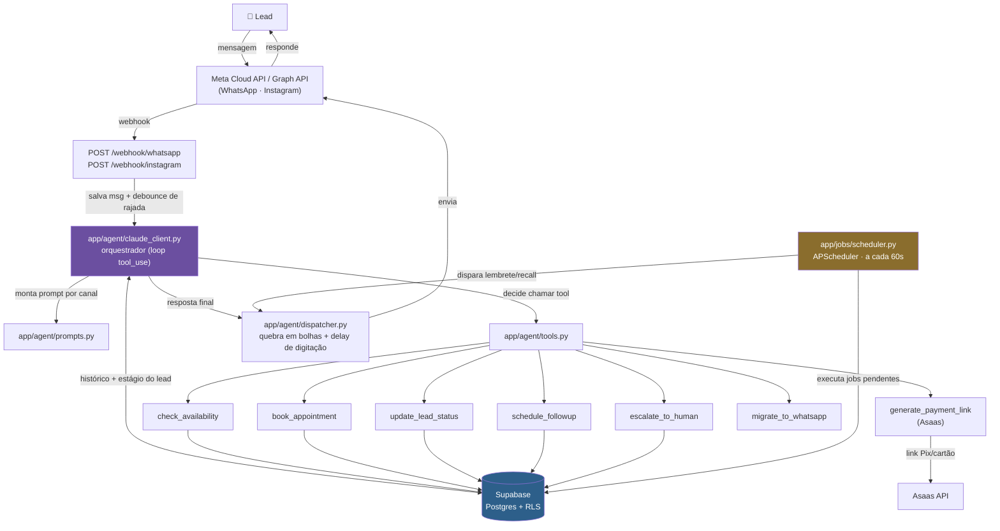

# Automação Completa — Agente de Vendas IA para Clínicas de Estética

Agente de IA que substitui o atendimento humano de clínicas de estética de alto ticket
(harmonização facial, botox, preenchimento, implante) do primeiro contato ao fechamento,
via **WhatsApp e Instagram**. Não é um chatbot de fluxo fixo — o cérebro é a Claude API
com *tool use*, que decide sozinha quando qualificar, checar agenda, agendar, cobrar
sinal, escalar pra humano ou fazer follow-up.

Multi-tenant: uma instância atende várias clínicas, cada uma com seu próprio número de
WhatsApp, serviços, horários e configurações — isolamento garantido por Row Level
Security no Supabase.

---

## O que o agente faz

1. **Qualifica** o lead com BANT (Budget, Authority, Need, Timeline) de forma
   conversacional — nunca como formulário.
2. **Agenda** consultas/avaliações, checando disponibilidade e confirmando data/hora.
3. **Cobra sinal** via link de pagamento Pix/cartão (Asaas) antes de confirmar de vez.
4. **Faz follow-up automático**: lembrete de agendamento (D-1), recuperação de
   pagamento não concluído, pós-venda, e recall de procedimento (ex: retorno do botox
   em 180 dias) — tudo agendado no Supabase e executado por um scheduler que roda a
   cada 60s, sobrevivendo a restart do servidor.
5. **Escala para humano de verdade** quando o lead pede pra falar com uma pessoa ou
   relata uma reação pós-procedimento grave — a IA para de responder até alguém da
   equipe reativar.
6. **LGPD como feature, não obrigação**: opt-in explícito na primeira mensagem,
   registro de consentimento (`consent_log`), comando `SAIR` pra opt-out imediato.

---

## Arquitetura



---

## Tools do Claude (function calling)

Todas definidas e executadas em `app/agent/tools.py`. O modelo decide quando chamar
cada uma — nada é forçado por regex ou máquina de estados fixa.

| Tool | O que faz | Observação |
|---|---|---|
| `check_availability` | Consulta horários livres antes de agendar | ⚠️ ainda **mock** — gera horários plausíveis, não bate em agenda real |
| `book_appointment` | Cria/atualiza o agendamento no Supabase | Evita duplicar: se o lead já tem um agendamento futuro em aberto, atualiza em vez de criar outro |
| `generate_payment_link` | Gera link de pagamento Pix/cartão/boleto via Asaas | Só deve ser chamada após confirmar urgência/decisão do lead |
| `update_lead_status` | Move o lead no funil: `novo → qualificado → agendado → fechado → frio` | Escreve na coluna `leads.stage` |
| `schedule_followup` | Agenda um job de follow-up (`appointment_reminder`, `payment_recovery`, `pos_venda`, `recall_procedimento`) | Aceita `days` customizado — recall usa a config `tenants.procedimentos_recall` |
| `escalate_to_human` | Transfere pra um atendente humano de verdade | Seta `leads.escalado = true` (a IA para de responder) e manda notificação real pro `tenants.staff_phone` |
| `migrate_to_whatsapp` | No Instagram, manda o lead pro WhatsApp quando ele quer fechar | Pagamento e agendamento só rolam pelo WhatsApp |

O servidor **nunca confia no `lead_id` que o modelo devolve** — ele sempre sobrescreve
com o UUID real da conversa antes de executar a tool, porque o modelo não tem esse ID
em lugar nenhum do contexto e, se deixado por conta própria, inventa um placeholder.

---

## Stack

| Camada | Tecnologia |
|---|---|
| Servidor | FastAPI (Python 3.11+), Uvicorn |
| IA / orquestração | Claude API (Anthropic) com tool use — `claude-sonnet-5` |
| Banco de dados | Supabase (Postgres) com Row Level Security multi-tenant |
| WhatsApp | Meta Cloud API oficial |
| Instagram | Meta Graph API oficial |
| Pagamento | Asaas (Pix, cartão, boleto) |
| Scheduler | APScheduler in-process, estado 100% no Supabase |
| Rate limiting | slowapi |

---

## Rodando localmente

### 1. Dependências
```bash
python -m pip install -r requirements.txt
```

### 2. Supabase
1. Crie um projeto em [supabase.com](https://supabase.com).
2. No SQL Editor, rode nesta ordem: `database/schema.sql` → `migration_v2.sql` →
   `migration_v3.sql` → `migration_v4.sql` → `migration_v5.sql`.
3. Copie a `Project URL` e a `service_role` key em Project Settings → API.

### 3. `.env`
```env
ANTHROPIC_API_KEY=sk-ant-...
SUPABASE_URL=https://xxx.supabase.co
SUPABASE_SERVICE_ROLE_KEY=eyJ...
META_VERIFY_TOKEN=qualquer_string_secreta
ADMIN_API_KEY=defina_uma_chave_forte
PORT=8000
# Produção: META_WA_TOKEN, META_WA_PHONE_NUMBER_ID, WHATSAPP_APP_SECRET,
# META_IG_ACCESS_TOKEN, META_IG_PAGE_ID, ASAAS_API_KEY
```

### 4. Criar um tenant de teste
```bash
curl -X POST "$SUPABASE_URL/rest/v1/tenants" \
  -H "apikey: $SUPABASE_SERVICE_ROLE_KEY" \
  -H "Authorization: Bearer $SUPABASE_SERVICE_ROLE_KEY" \
  -H "Content-Type: application/json" \
  -d '{"name":"minha-clinica","clinic_name":"Clinica Exemplo","professional_name":"Dra. Exemplo","phone_number_id":"000","whatsapp_token":"demo"}'
```

### 5. Rodar
```bash
python main.py
```

### 6. Testar (sem precisar de WhatsApp real)
```bash
curl -X POST http://localhost:8000/chat \
  -H "Content-Type: application/json" \
  -d '{"tenant_name": "minha-clinica", "phone": "5585999999999", "message": "oi"}'
```

---

## Endpoints

| Método | Rota | Descrição |
|---|---|---|
| GET | `/` | Status + total de tenants ativos |
| POST | `/chat` | Teste direto por `tenant_name`, sem passar pelo WhatsApp |
| GET / POST | `/webhook/whatsapp` | Verificação Meta + recebe mensagens (com idempotência por `wamid` e debounce de rajada) |
| GET / POST | `/webhook/instagram` | Verificação Meta + recebe DMs |
| POST | `/payment/confirm` | Callback Asaas — marca lead como `fechado`, agenda job `pos_venda` |
| GET | `/tenants` | Lista tenants ativos *(admin)* |
| GET | `/leads/{tenant_name}` | Lista leads, filtros `status`/`canal`/`desde` *(admin)* |
| DELETE | `/lead/{tenant_name}/{phone}` | Reseta lead e histórico *(admin, testes)* |
| PATCH | `/lead/{tenant_name}/{phone}/escalar` | Marca lead como escalado manualmente *(admin)* |
| PATCH | `/lead/{tenant_name}/{phone}/desescalar` | Devolve o lead pra IA *(admin)* |

Rotas *(admin)* exigem o header `X-Admin-Key` com o valor de `ADMIN_API_KEY`.

---

## Schema do banco (Supabase)

| Tabela | Pra que serve |
|---|---|
| `tenants` | Um registro por clínica: nome, credenciais Meta/Asaas, serviços, horários, `staff_phone` (pra onde escala), `procedimentos_recall` |
| `leads` | Um contato por tenant. Guarda `stage` (funil), `escalado` (handoff humano), dados coletados na conversa |
| `conversations` | Histórico completo de mensagens (`role` user/assistant) — é o que vira o contexto enviado à Claude a cada turno |
| `sessions` | Estado leve da sessão (estágio + última atividade) |
| `appointments` | Agendamentos confirmados — `lead_id`, `service`, `scheduled_at` |
| `followup_jobs` | Fila de mensagens futuras (`appointment_reminder`, `payment_recovery`, `pos_venda`, `recall_procedimento`) — o scheduler varre a cada 60s |
| `consent_log` | Um registro por lead na primeira mensagem — evidência do opt-in LGPD |
| `processed_messages` | Guarda o `wamid` de cada mensagem WhatsApp já processada — evita reprocessar quando a Meta reenvia o mesmo webhook |

RLS ativo em todas as tabelas: só a `service_role` (backend) tem acesso; nada é exposto
publicamente.

---

## Status atual

### ✅ Testado e funcionando (verificado direto no banco, não só no texto da IA)
- LGPD só na primeira mensagem, com nome da profissional, sem inventar nome do lead
- Qualificação BANT natural até o agendamento
- Objeção de preço: reancora valor, oferece avaliação gratuita, nunca dá desconto
- Cálculo de data correto (com data/hora atual injetada no prompt) e correção quando o
  lead muda de ideia no meio (troca de dia, período ou horário)
- Agendamento grava em `appointments` de verdade, sem duplicar em confirmações repetidas
- `consent_log` grava exatamente 1 registro por lead novo
- Guardrail médico: recusa diagnosticar sintoma/mancha, orienta buscar profissional
- Reação pós-procedimento grave: escala pra humano em vez de tranquilizar
- "Quero falar com humano": chama `escalate_to_human`, `leads.escalado` vira `true`
  no banco, e a IA fica muda nas mensagens seguintes desse lead
- `SAIR`: lead vira `stage=frio`; se voltar a mandar mensagem por conta própria, o
  estágio é reativado pra `novo` automaticamente (sem precisar de reset manual)
- Pergunta fora de escopo: admite que não sabe, não inventa
- Múltiplos procedimentos na mesma conversa
- Rajada de mensagens rápidas do mesmo número: debounce evita respostas concorrentes
  e duplicadas
- Conversas longas (20+ mensagens) sem quebrar — histórico é buscado corretamente em
  ordem cronológica
- Idempotência de webhook: reenvio da Meta com o mesmo `wamid` não reprocessa

### ❌ Não existe ainda (fora do escopo atual)
- **Cancelamento / remarcação** de agendamento pelo próprio lead
- `check_availability` ainda é **mock** — não bate contra agenda real (Google
  Calendar ou tabela de disponibilidade)
- Templates HSM aprovados no Meta Business (obrigatório pra mensagem proativa em
  produção — `appointment_reminder`, `payment_recovery`, `pos_venda`)
- Deploy em produção (Railway) e configuração dos webhooks com domínio final

---

## Custo estimado

| Item | Custo |
|---|---|
| Claude API | ~R$ 0,25 por conversa completa |
| Supabase | Grátis até 500MB (free tier) |
| Railway | ~$5/mês |
| WhatsApp Cloud API | Grátis até 1.000 conversas/mês |
